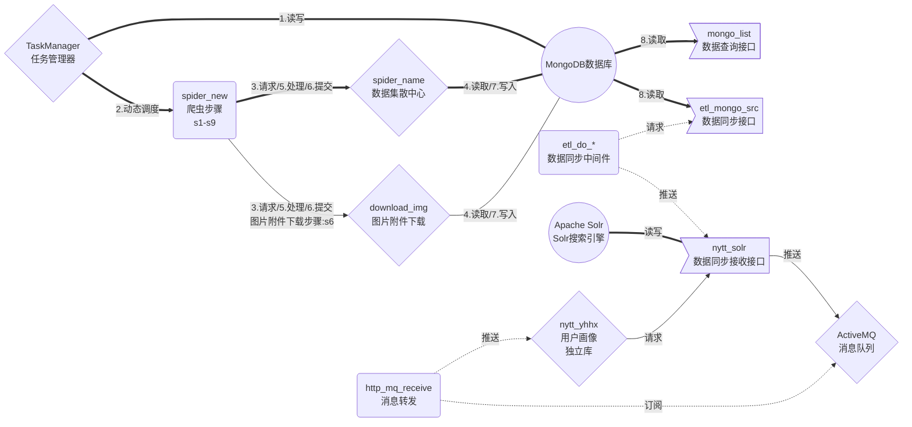

# 一套基于Nodejs语言、Go语言开发的爬虫服务

## 模型架构

    spider_new模块包含s1-s9(共9个步骤:详情请查看spider_new目录下的README.md文件)

## 1. 技术框架

> - **Nodejs语言** *步骤主体开发语言,方便解析html*
> - **Go语言** *接口开发:用户大部分接口及服务*
> - **Phantomjs** *无头浏览器:用于获取渲染后的HTML*
> - **MongoDB数据库** *数据持久化*
> - **Solr** *加速查询:分词查询*
> - **ActiveMQ** *消息通知:通知记录用户画像*

## 2. 目录说明

### 2.1 任务管理器

> **TaskManager_go** 任务管理器接口服务
> **TaskManger_Web** 任务管理器WEB服务

### 2.2 爬虫核心业务服务及接口

> **spider_name** 爬虫数据集散中心服务
> **download_img** 附件下载服务
> **spider_new** 爬虫业务步骤
> **etl_mongo_src** Mongo数据查询接口服务

### 2.3 数据同步中间件

> **etl_do_tagArticle** 文章信息同步中间件
> **etl_do_sell** 供应信息同步中间件
> **etl_do_buy** 求购信息同步中间件
> **etl_do_price** 价格信息同步中间件
> **etl_do_recruit** 招聘信息同步中间件
> **etl_do_download** 图片附件同步中间件

### 2.4 接收服务

> **nytt_solr** Solr接收与查询接口
> **etl_tar_download** 图片附件接收服务

### 2.5 其他服务

> **mongo_list** 等同etl_mongo_src服务部分接口
> **nytt_yhhx** 用户画像(用于记录用户兴趣内容)
> **http_mq_receive** MQ消息队列接收端
> **http_mq_send** MQ消息队列发送端(仅用于测试)

### 2.6 政务云 舆情业务

> **zwy** 政务云>廉政云>舆情业务(定制业务)
