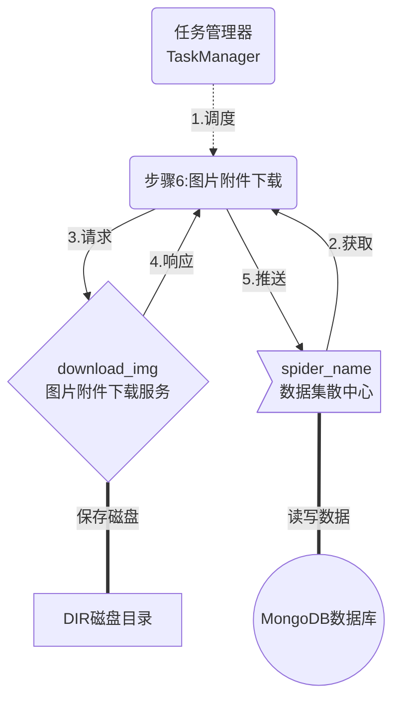

# 图片附件下载服务

> 本程序本意为:为爬虫第六步(/spider_new/6_spider_img_download)提供文件下载接口
> 并为整个爬虫提供图片附件提供同一管理
> 同时提供了图片附件下载记录的相应接口

## 示意图



## 1. 配置文件详解

```ini
# 数据库配置
[database]
 数据库链接
 dbURL = mongodb://127.0.0.1:27017
 库名
 dbName = db_spider_tx
 查询接口默认分页大小
 pageSize = 30
 默认排序方式
 sortCol = -_id
# 接口配置
[api]
 图片附件下载记录接口
 downImg = /spiderdb_img_download/downImg
 下载图片附件接口基链
 updownload = /spiderdb_img_download/updownload
 接口启用端口
 port = 3001
# 文件存储配置
[uploadfile]
 图片附件保存路径
 savepath = D:/Temp/images/
 缩略图保存路径(已失效)
 smallsavepath = D:/Temp/small_image/
 缩略图宽度(已失效)
 smallimglength = 0
 缩略图高度(已失效)
 smallimghight = 73
```

## 2. 接口说明

### 2.1 图片附件记录相关接口

**POST** <http://localhost:3001/spiderdb_img_download/downImg/list> **查询接口**

```javascript
{
    "currentPage":1,   //当前页号
    "pageSize":30,  //分页大小
    "conf":{    //查询体检
        //允许Downimg对象所有属性
    }
}
```

    conf配置请参照Downimg结构体

**POST** <http://localhost:3001/spiderdb_img_download/downImg/add> **增加接口**

```javascript
{
    //这里是一个Downimg对象基本支持所有属性
}
```

    id,version(可忽略)均由系统内部赋值

**POST** <http://localhost:3001/spiderdb_img_download/downImg/edit> **编辑接口**

```javascript
{
    //这里是一个Downimg对象基本支持所有属性
}
```

    id,version(必填),将通过这两个参数筛选更新

**POST** <http://localhost:3001/spiderdb_img_download/downImg/findOne> **查询单条**

```javascript
{
    //这里是一个Downimg对象基本支持所有属性
}
```

    通过属性筛选获取第一条记录

### 2.2 图片附件下载接口

**POST** <http://localhost:3001/spiderdb_img_download/updownload/download> **下载接口**

```javascript
{
    "img_src":""    //图片源
    "img_url":"",   //相对路径名
    "img_name":"",  //保存名称
}
```

    最后会将img_src对应的文件写入到{uploadfile.savepath}/{img_url}/{img_name}文件中