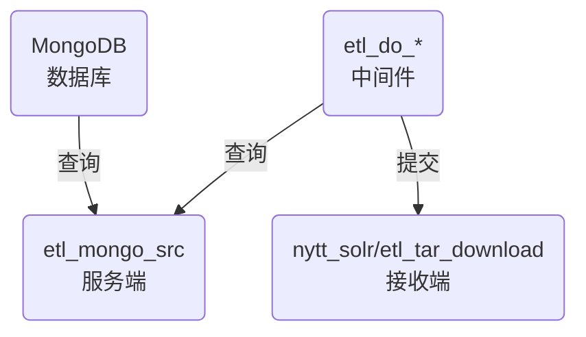

# 数据同步中间件

> 程序说明:本程序用意于将爬虫数据通过同步中间件同步至solr服务(仅数据)/另一台服务器(仅图片附件)
> 该目录下程序均为此过程中的同步中间件
> 服务端(etl_mongo_src) > 中间件(etl_do/etl_do_download) > 接收端(nytt_solr/etl_tar_download)

## 示意图

    etl_tar_download模块只用于接收图片附件