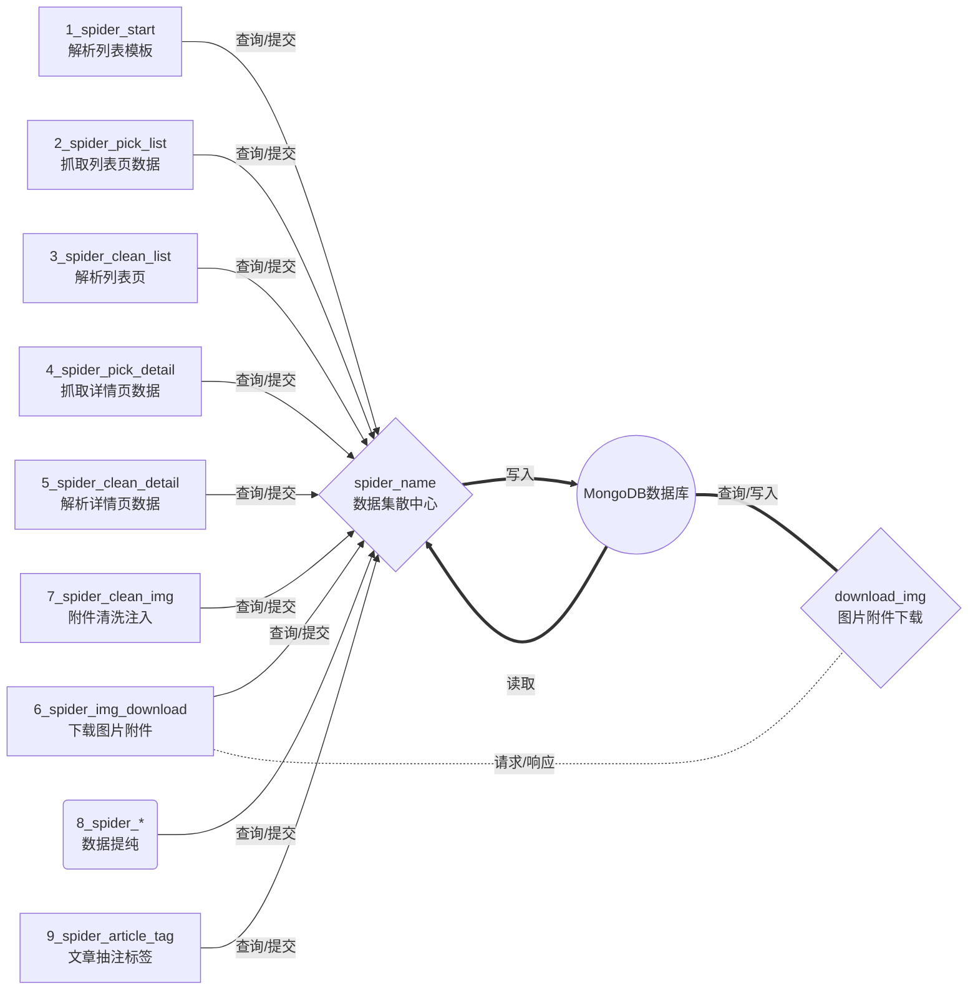

# 爬虫架构说明

> 程序说明:该目录下每个js文件为一个爬虫步骤
> npm install (初始化,注:初始化只需一次)
> node.exe *_spider_*.js (启动)

[TOC]

## 1. 设计模型



## 2. 各步骤大致数据处理流程

```sequence
Title:时序图
步骤N->数据集散中心: 查询指定接口&指定状态的数据\nPOST /spiderdb/spiderconfig/list\n{status=0}
数据集散中心-->MongoDB: 查询数据
MongoDB-->数据集散中心: 返回数据
数据集散中心->步骤N: 返回相应数据
步骤N->步骤N: 数据加工\n(示例:2.列表抓取/5.详情解析/8.数据提纯)
步骤N->数据集散中心: 提交处理后的数据并标记为已处理数据
数据集散中心-->MongoDB: 持久化数据
```

    步骤N:代表图一中1-9步其中之一(/spider_new/{i}_spider_*)
    数据集散中心:相对"步骤N"来说,统一对数据进行查询与储存的服务(spider_name)

## 3. 流程图 TODO

```flow
st=>start: 开始
e=>end: 结束
op1=>operation: 列表模板配置
op2=>operation: 爬虫步骤
sub1=>subroutine: 图片附件转储
sub2=>subroutine: 接口
cond=>condition: 条件分支1
cond2=>condition: 条件分支2
io=>inputoutput: 产出

st->op1->cond
cond(yes)->cond2
cond(no)->sub1->op1
cond2(yes)->io->e
cond2(no)->op2->io
```