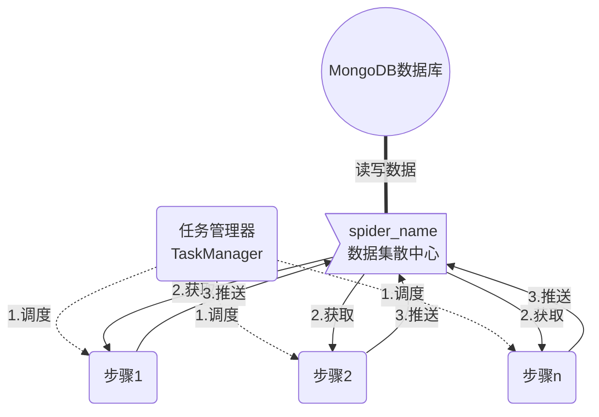
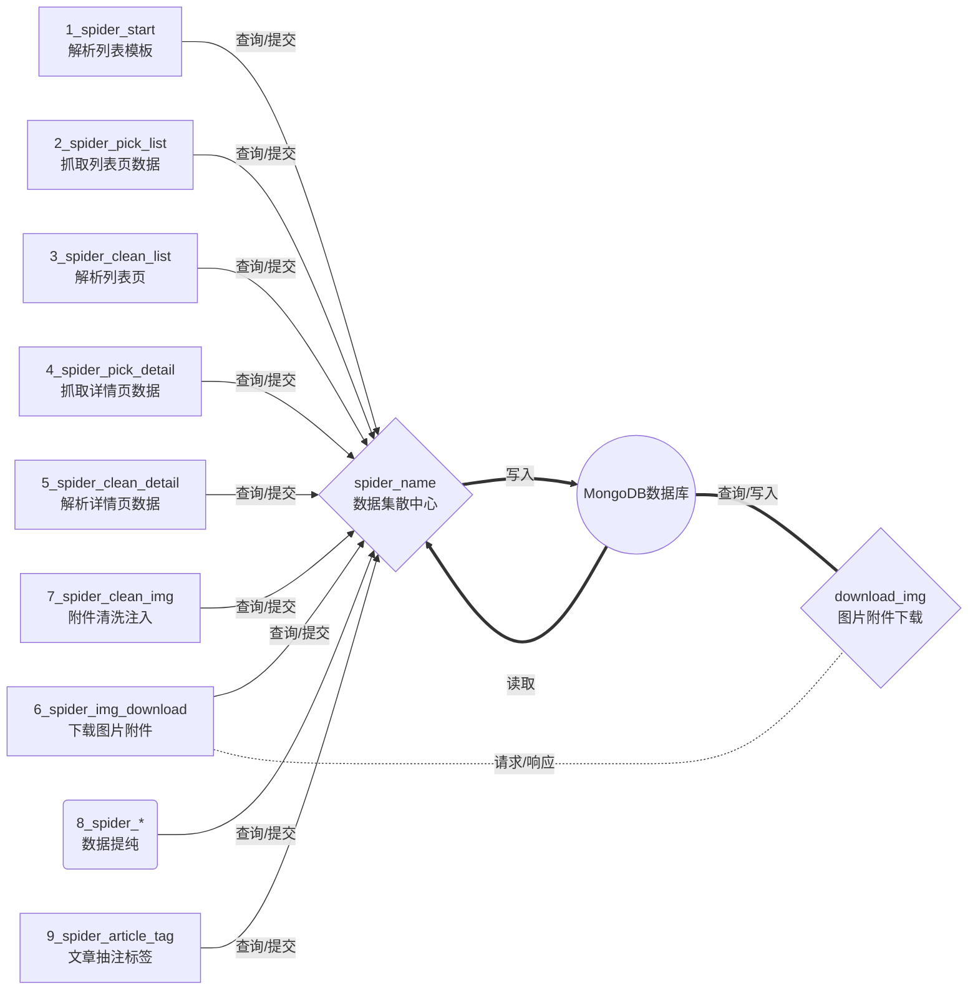

# 数据集散中心服务

## spider_name介绍

> 程序说明:本程序用意于将爬虫数据集散中心接口
> 该程序为所有爬虫步骤(spider)过程中需要操作的数据提供接口，包括查询/增加/修改/删除

## 配置详解

## 接口说明

## 示意图

```mermaid
graph TB
MD((MongoDB数据库))
SN>spider_name<br>数据集散中心]
TM(任务管理器<br>TaskManager)
s1(步骤1)
s2(步骤2)
sn(步骤n)

TM-.->|1.调度|s1
TM-.->|1.调度|s2
TM-.->|1.调度|sn
MD===|读写数据|SN
SN-->|2.获取|s1
SN-->|2.获取|s2
SN-->|2.获取|sn
s1-->|3.推送|SN
s2-->|3.推送|SN
sn-->|3.推送|SN
```

```mermaid
graph LR
s1[1_spider_start<br>解析列表模板]
s2[2_spider_pick_list<br>抓取列表页数据]
s3[3_spider_clean_list<br>解析列表页]
s4[4_spider_pick_detail<br>抓取详情页数据]
s5[5_spider_clean_detail<br>解析详情页数据]
s6[6_spider_img_download<br>下载图片附件]
s7[7_spider_clean_img<br>附件清洗注入]
s8(8_spider_*<br>数据提纯)
s9[9_spider_article_tag<br>文章抽注标签]
SN{spider_name<br>数据集散中心}
DL{download_img<br>图片附件下载}
MD((MongoDB数据库))

s1-->|查询/提交|SN
s2-->|查询/提交|SN
s3-->|查询/提交|SN
s4-->|查询/提交|SN
s5-->|查询/提交|SN
s6-->|查询/提交|SN
s7-->|查询/提交|SN
s8-->|查询/提交|SN
s9-->|查询/提交|SN
SN==>|写入|MD
MD==>|读取|SN
MD===|查询/写入|DL
s6-.-|请求/响应|DL
```